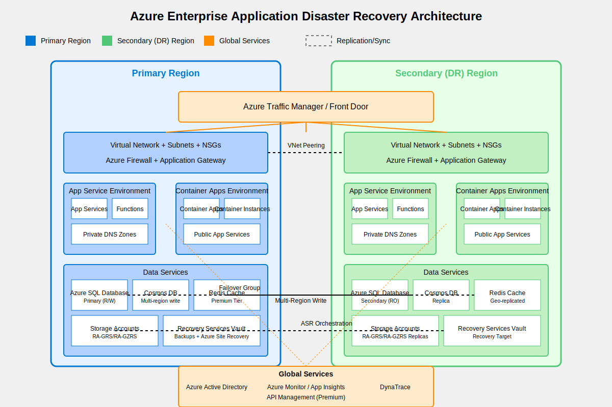

# Azure Enterprise Application Disaster Recovery

This project provides a comprehensive disaster recovery (DR) solution for large-scale enterprise applications composed of several components hosted on the Microsoft Azure platform.

## Project Goals

### Primary Objectives

1. **Business Continuity Assurance**: Ensure critical business applications remain operational during regional failures or disasters.

2. **Data Protection**: Safeguard critical client data in Azure SQL Databases and Infrastructure-as-Code state files in Storage Accounts.

3. **Meet Recovery Targets**:
   - **Recovery Time Objective (RTO)**: 
     - Tier 1 (Critical): < 1 hour
     - Tier 2 (Important): < 4 hours
   - **Recovery Point Objective (RPO)**:
     - Tier 1 (Critical): Near zero data loss
     - Tier 2 (Important): < 15 minutes

4. **Automated Recovery**: Minimize manual intervention required during failover scenarios.

5. **Regular Testing**: Establish procedures for periodic testing of the DR solution without impacting production workloads.

### Secondary Objectives

1. **Cost Optimization**: Balance disaster recovery capabilities against operational costs.

2. **Documentation**: Provide comprehensive documentation for failover procedures.

3. **Monitoring**: Implement real-time monitoring of the DR environment.

4. **Compliance**: Ensure the DR solution meets any regulatory requirements.

## Technical Approach

### Architecture Overview

The disaster recovery architecture employs a comprehensive multi-region approach with the following key components:

1. **Global Traffic Management**:
   - Azure Traffic Manager / Front Door for global load balancing
   - Health probes to automatically detect regional failures
   - Manual failover capability for planned maintenance

2. **Compute Resource Strategy**:
   - Identical compute infrastructure in primary and DR regions
   - App Service Environments (ASE) in both regions
   - Container Apps Environments in both regions
   - Public App Services with multi-region deployment
   - Azure Functions with multi-region deployment

3. **Data Replication Mechanisms**:
   - Azure SQL Database: Failover groups with continuous replication
   - Cosmos DB: Multi-region write capability
   - Redis Cache: Geo-replication (Premium tier)
   - Storage Accounts: RA-GRS/RA-GZRS for geo-redundancy
   - Recovery Services Vaults: Cross-region backup and recovery

4. **Networking Configuration**:
   - Mirrored VNet configuration in both regions
   - VNet peering for cross-region private communication
   - Identical Application Gateway configurations
   - Synchronized Azure Firewall policies
   - Private DNS Zones in both regions

5. **Identity and Access Strategy**:
   - Azure Active Directory (globally redundant)
   - Synchronized RBAC policies across regions
   - Managed Identities with appropriate permissions in both regions

6. **Monitoring and Orchestration**:
   - Azure Monitor / Application Insights spanning both regions
   - DynaTrace for advanced application performance monitoring
   - Azure Site Recovery for orchestrated failover
   - Automated runbooks for specific recovery procedures

### Implementation Phases

1. **Assessment and Planning Phase**:
   - Document current application architecture
   - Define recovery objectives for each component
   - Identify dependencies and potential bottlenecks
   - Create detailed implementation plan

2. **Infrastructure Setup Phase**:
   - Establish secondary region infrastructure
   - Configure network connectivity between regions
   - Set up monitoring and alerts

3. **Data Replication Phase**:
   - Implement database replication mechanisms
   - Configure storage redundancy
   - Validate data consistency across regions

4. **Application Deployment Phase**:
   - Deploy application components to secondary region
   - Configure load balancing and traffic routing
   - Implement health checks and failover triggers

5. **Testing and Validation Phase**:
   - Develop test scenarios and expected outcomes
   - Conduct controlled failover tests
   - Document results and refine procedures

6. **Documentation and Training Phase**:
   - Create comprehensive DR documentation
   - Develop standard operating procedures
   - Train teams on failover procedures

7. **Operational Phase**:
   - Implement regular DR drills
   - Continuous monitoring and improvement
   - Periodic review of recovery objectives

### Testing Strategy

1. **Component-Level Testing**:
   - Individual service failover testing
   - Data replication validation
   - Network connectivity verification

2. **Application-Level Testing**:
   - Functional testing during simulated regional outage
   - Performance testing in failover scenarios
   - User experience validation

3. **Full DR Simulation**:
   - Scheduled complete failover exercises
   - Recovery time measurement
   - Data consistency verification

4. **Chaos Engineering**:
   - Controlled fault injection
   - Resilience testing under unexpected conditions

## Success Criteria

The disaster recovery solution will be considered successful when:

1. All critical applications can be recovered within the defined RTO
2. Data loss during recovery remains within the defined RPO
3. Failover procedures are documented and tested
4. Application functionality in the DR region matches production
5. Monitoring provides clear visibility into DR readiness status

## Current Status

This project is currently in the initial planning and architecture design phase.
